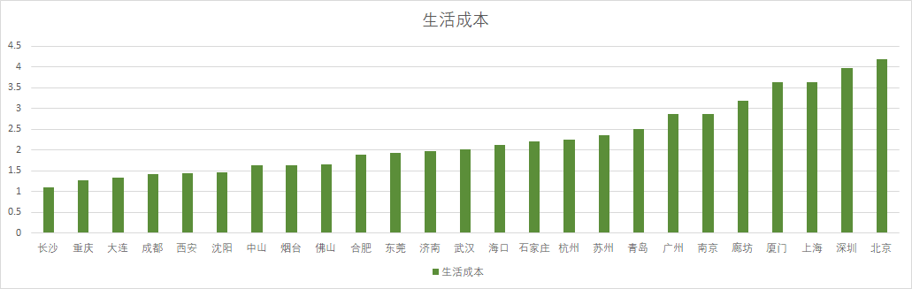
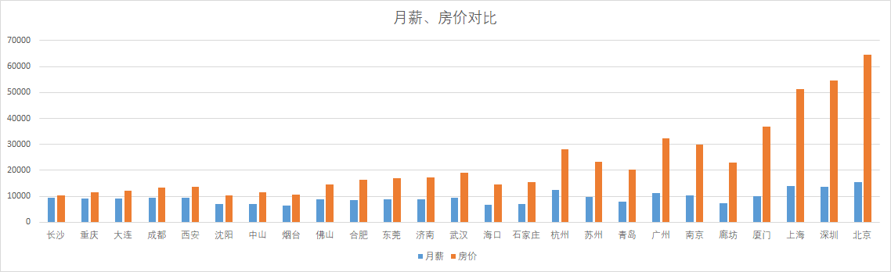
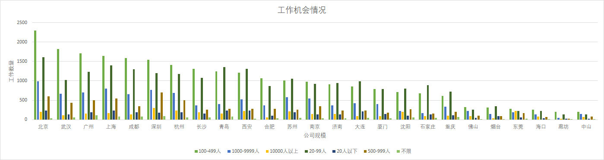
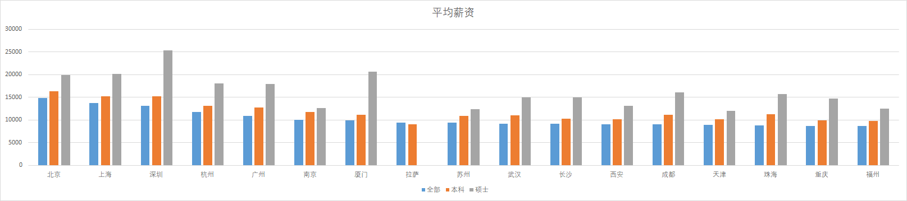
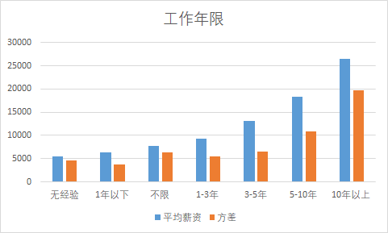
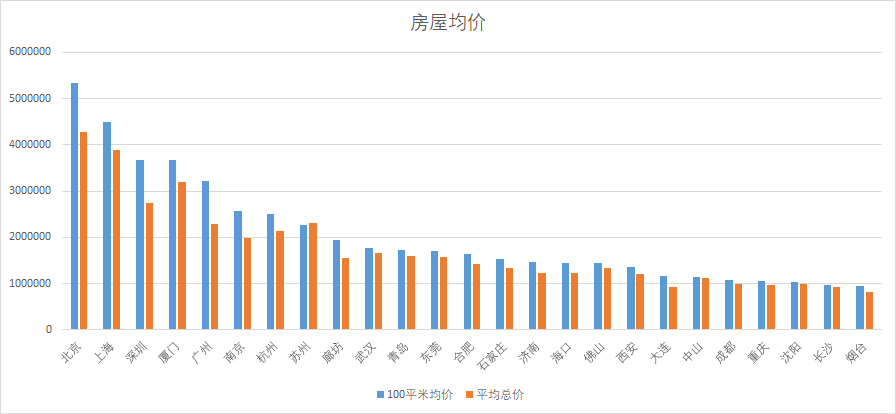
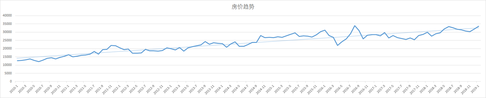

# 逃离北上广

>[项目主页](https://jiangwei1995910.github.io/getAwayBSG/)


## 2019-03-03 Update Log

添加了一个抢自如房子的脚本，grabZiroom.py，定时脚本设置为2分钟运行一次，会自动检查某个房屋是否可以下单，能下单则发邮件通知


##  2019-02-23 Update Log

添加了自如租房的爬虫，只爬取了北京的数据。目前服务器已经运行了一个月了，总共抓取了链家约120万的数据量，抓取智联招聘约40万的数据量。

## What!

如果你是一个正准备逃离北上广等一线城市却又找不到去处的IT人士，或许这个项目能给你点建议。

## Desc

或许你跟我一样困惑，为此我通过爬虫抓取了智联招聘跟链家这2个平台的全部数据。最终拿到了18W+全国各个城市的招聘数据与81W+全国各地的房屋成交记录数据。

其中，招聘数据我抓取了工作年限，公司名称，公司规模，公司类型，工作类型，创建时间，工作名称，结束时间，教育情况，薪资字段。

职位我使用了['php', 'java', 'python', 'c/c++', 'c#', 'mysql', 'oracle', 'javascript', 'linux', 'SQL', '软件', '程序员']作为关键词搜索。基本上涵盖了程序猿们绝大部分工作

对应房屋成交记录，我抓取了成交时间，成交价格，每平米均价，地址字段。

## 分析

### 综合分析

首先，房价和薪资都没法代表一个地方的生活成本情况。因此我使用了（月薪/每平米房价）的倒数值来表示一个城市的生活成本。这个值越大，表面这个地方的生活成本越高。结果如下图

结果很明显了，如果你想去一个安稳生活的地方，这个表中前几的城市都不错，买房压力较低，并且我相信经常逛Github的程序猿肯定都是平均薪资几倍的收入。反之，如果你想挑战人生的地狱模式，emmmmm


另外，也附上各个城市的月薪，每平米房价对比情况


### 工作机会

统计了各个规模公司的招聘数量



### 薪资

首先，我计算了各个城市的平均薪资情况，为什么不包含博士学历呢？因为智联上面写明要博士的职位很少(硕士其实也不多，只有几百的量)，抓下来每个城市都是几十的量，这种数据不具有统计意义如下：



可见，硕士的薪资跟本科比并没多大差距。另外，别小看了拉萨，拉萨的薪资并不低，但是方差特别大，说明如果你愿意去拉萨，其实你的薪资会很高，平均薪资低是因为有很多1000 2000的工作拉下去的

其他都是意料之中的了


其实，平均值并没有多大参考意义，因为被平均的东西太多了，比如工龄就是很重要一个，于是我又取了各工龄的情况，如下



### 房价

对于一个地方是否合适自己发展，房价非常重要，于是我也分析了各个城市的房价数据。

首先，也先来个平均



其次，也来个近10年房价的走势图吧

似乎有个大致规律，上半年涨，下半年跌。


## 未完成 TODO

目前只统计了IT行业的情况

另外，目前爬虫只跑了一遍，只抓取了2019-01-21到24号的数据。数据量虽然有18万，81万，但是如果能长期抓取半年、一年的话，数据量更大的话，数据将更有可信度。


## More !

这份分析仅供参考。

如果你想自己分析，你可以如下操作
```
git clone https://github.com/jiangwei1995910/getAwayBSG

pip3 install -r requirements.txt

```

在你的mysql中运行SQL.sql文件创建数据表

然后进入config文件夹里面，配置你自己的数据库信息，

安装tesseract4.0，将字库文件fontyp.traineddata放到tesseract的tessdata目录中

最后修改crontab文件的路径，将其设置成你的crontab配置


## 实现

智联招聘跟链家这2个网站绝对是我这辈子见过对爬虫最友好的网站！要脱库真的太简单了。尤其是智联，直接调AJAX接口就行了，简直比有些公司合作接口还好用。链家的话，直接上scrapy，半个小时搞定。

### 自如

自如加了一定的反爬措施，不过也很简单。首先请求必须带上UA数据，其次自如的价格数据全部使用图片展示，返回一个0到9的数字图片，前端使用span便签设置backgroup加偏移量显示。

#### 破解

1.请求都设置上UA

2.价格数据由于都是一样的字体，永远不会变，只是顺序随机，我使用了tesseract然后自己训练了字库，识别率基本上达到100%准确度。训练好的字库文件是fontyp.traineddata，放到tesseract的tessdata目录中即可使用（tesseract版本必须是4.0，字库对其他版本不兼容）
